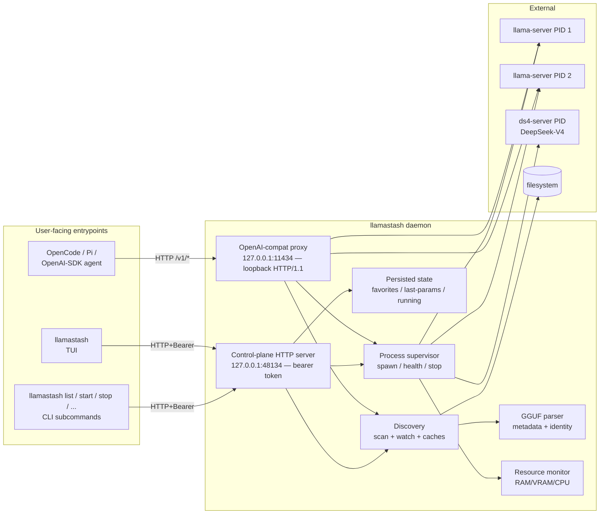
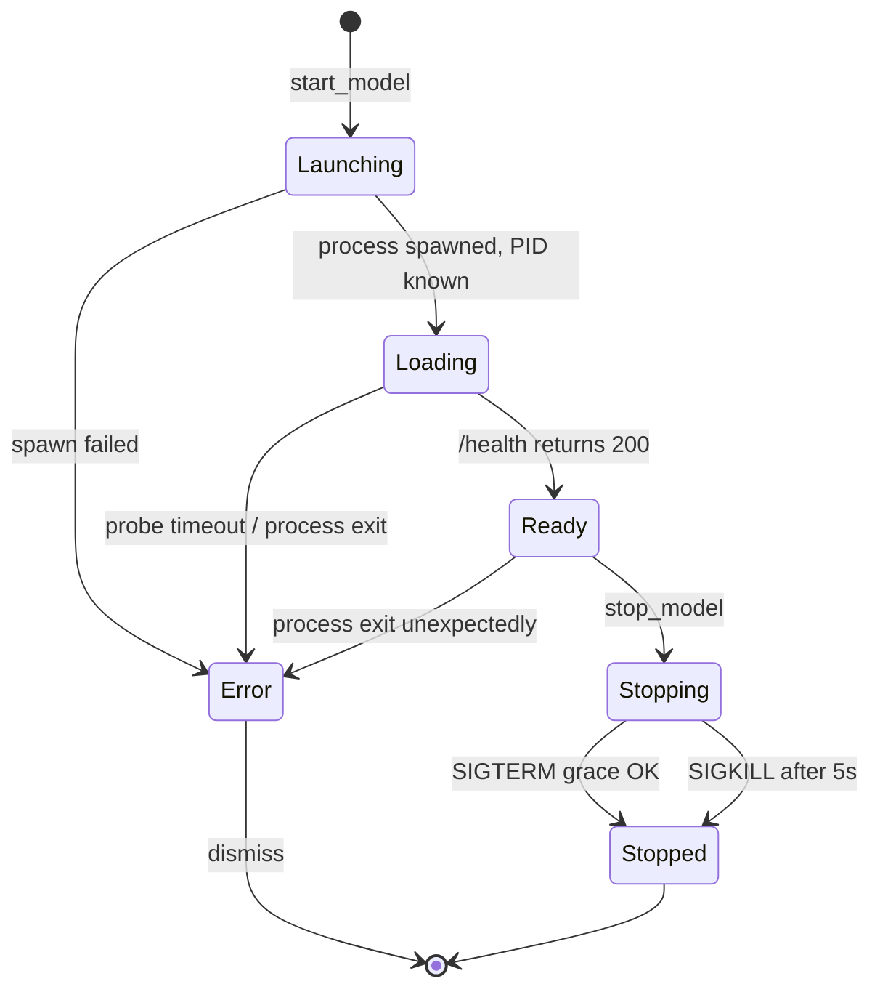

# Architecture

This is the architecture as it ships through v2. Authoritative sources for design intent and tradeoffs: [v1 plan](plans/2026-05-13-001-feat-llamatui-v1-launcher-plan.md), [v2 plan](plans/2026-05-18-001-feat-init-wizard-doctor-pull-plan.md). This document is a stable, user-readable summary of what's actually in the binary.

## v2 additions in one breath

```
llamastash init   ─┬─► detection (gpu::probe + RAM + binary locate)
                  ├─► install (GH Releases | brew | custom_path)
                  ├─► recommender (snapshot models × hardware fit × score)
                  ├─► download (hf-hub → ~/.cache/huggingface/hub/...)
                  ├─► config writer (atomic + 0600 + recursive merge + redaction)
                  ├─► smoke (phase-1 dry-run + binary --version probe)
                  └─► init_snapshot.json (sibling of state.json)

llamastash doctor ─► detection + init_snapshot diff → typed findings
llamastash pull   ─► hf-hub → HF cache layout
```

Three submodule groupings under `src/init/`:

- **Fetch substrate** — `fetch.rs` + `fetch_policy.rs` enforce the v2 fetch contract (host allowlist, redirect cap, body cap, HTTPS-only) on snapshot fetch and GH Releases install. HF traffic is carved out: `download.rs` uses the `hf-hub` crate, which talks only to `huggingface.co` and its LFS CDN — already constrained host families. `FetchClient::is_offline()` is still consulted so `--offline` / `LLAMASTASH_OFFLINE` short-circuits the HF path too.
- **Snapshots** — `snapshot.rs` owns `init_snapshot.json` (per-machine wizard record); `benchmark.rs` owns the bundled+remote `BenchmarkSnapshot` (the curated model catalog + recommender weights).
- **Wizard surface** — `detection.rs` (shared by init + doctor), `recommender.rs` (pure ranking, plus `vram_fit_for_file` used by the TUI HF picker), `install/*` (three install routes), `download.rs` (HF pull via `hf-hub`), `config_writer.rs` (atomic write + diff + redaction), `smoke.rs` (phase-1 + version probe), `wizard.rs` (6-step orchestrator), `doctor.rs` (read-only diagnostic).
- **HF Hub API client** — `hf_api.rs` issues `/api/models` search + per-repo file listing through `FetchClient` (cap, allowlist, offline branch fall out for free); pagination reads off the `Link` header but re-validates the next URL against the HF allowlist and extracts only the opaque `cursor` token. Powers the in-TUI HF pull dialog (`d`). Downloads still flow through `download.rs`'s `hf-hub` carve-out.

The TUI grows two new modules to host the dialog and its async surface:

- `tui::hf_dialog` — three-state modal (Search → File picker → Confirm), debounced live search with `query_seq` cancellation, slug-shortcut parsing via `RepoSpec::parse`, shard-collapse logic over the HF sibling listing, hardware-fit indicator pulling from the host-metrics snapshot.
- `tui::download_strip` — pinned single-line strip rendered below the info row when active; FIFO queue of pending pulls, an EMA-smoothed throughput readout, one active pull at a time, AlreadyCached short-circuit per R116.

## One binary, three roles



- **Daemon-on-demand.** The TUI and CLI both try to attach via `runtime.json` (URL + bearer token written by the daemon at startup). If absent or stale, they fork/exec `llamastash daemon start` (which detaches by default) and retry once the new daemon publishes a fresh `runtime.json`.
- **Control plane.** Loopback HTTP/1.1 on `127.0.0.1:48134` (with a small scan window if the slot is taken; deliberately above IANA's registered range and outside the `1143x` proxy family). Every route except `GET /health` requires a `Bearer` token validated in constant time. The token is 32 bytes from `OsRng`, rotated per daemon start, and persisted to `$XDG_STATE_HOME/llamastash/runtime.json` (mode `0600`) alongside the resolved URL. Wire protocol: JSON-RPC 2.0 envelopes carried in `POST /rpc` bodies.
- **Proxy.** An HTTP/1.1 listener enabled by default. In normal mode it prefers `127.0.0.1:11435`; in Ollama-compat mode it prefers `127.0.0.1:11434`. It routes `/health`, `/v1/models`, `/v1/chat/completions`, `/v1/completions`, `/v1/embeddings`, `/v1/rerank`, plus the Anthropic `/v1/messages` + `/v1/messages/count_tokens` (llama-server speaks these natively), by resolving `body.model` through the same fuzzy resolver as `llamastash start <ref>` and forwarding byte-for-byte to the matching `llama-server` child (auto-starting it if not running; falling back to a Ready model on launch failure with `x-llamastash-served-by` + `x-llamastash-fallback-reason` headers). Anthropic-shape clients (Claude Code via `ANTHROPIC_BASE_URL`) authenticate with the `x-api-key` header; `Bearer` and browser `Basic` are also accepted. It is the **only** listener that can be exposed to the LAN — `proxy.host` / `--proxy-host` binds a routable address, gated behind a bearer key (`proxy.api_key`, auto-provisioned; the daemon refuses a non-loopback bind with no key unless `--insecure-no-auth`). The control plane and `llama-server` children always stay loopback. TLS is still deferred, so LAN mode is plaintext. Implementation: `src/proxy/` (auth: `src/proxy/auth.rs`); user docs: [`usage.md §Proxy (OpenAI-compatible listener)`](usage.md#proxy-openai-compatible-listener); design: [`plans/2026-05-21-001-feat-proxy-router-plan.md`](plans/2026-05-21-001-feat-proxy-router-plan.md), [`plans/2026-06-09-001-feat-lan-exposed-proxy-auth-plan.md`](plans/2026-06-09-001-feat-lan-exposed-proxy-auth-plan.md).
- **State separation.** XDG-aware. `$XDG_STATE_HOME/llamastash/state.json` for favorites / last-params / running snapshot (persisted). `runtime.json` alongside it for the per-instance URL + bearer token (removed on shutdown). `$XDG_CONFIG_HOME/llamastash/config.yaml` for user-authored config, including the writable `presets:` store. `$XDG_CACHE_HOME/llamastash/logs/<id>-<ts>.log` for per-launch logs.

## Backends

llama.cpp is the direct, zero-overhead default; other engines plug in behind the `Backend` trait (`src/backend/`). Three ship today:

- **llama.cpp** (`src/backend/llama_cpp.rs`) — direct, process-per-model. Spawns one `llama-server` child per launch. The default for every GGUF that isn't ds4-routed.
- **Lemonade** (`src/backend/lemonade/`) — **experimental**, a managed multiplexer for NPU / multi-engine inference. LlamaStash supervises one `lemond` umbrella and delegates per-model load/unload. Default-on when the `lemond` binary resolves (like ds4), unless `backend.lemonade.enabled: false`; `--lemonade` / `LLAMASTASH_LEMONADE` force it on. See [Lemonade setup](lemonade-setup.md).
- **ds4 (DwarfStar)** (`src/backend/ds4/`) — **experimental**, direct, process-per-model, DeepSeek-V4-only. Spawns one `ds4-server` child. Default-on when the `ds4-server` binary resolves (`backend.ds4` / `--ds4` / `LLAMASTASH_DS4`); zero footprint when absent. New and lightly road-tested; llama.cpp stays the stable default and runs DeepSeek-V4 too on a current build (b9840+).

**Selection seam.** A plain (auto) launch picks a backend by model identity. The R13 rule — "a GGUF binds llama.cpp" — gains one exception: `ds4::ds4_compatible(header)`, a header-level predicate (arch `deepseek4` + a per-tensor-role quant contract), routes a compatible GGUF to ds4 when ds4 is available and the mode is chat/completions, and **falls back to llama.cpp otherwise — never a refusal** (a b9840+ llama.cpp runs DeepSeek-V4 too; an older build fails the load with `unknown model architecture: 'deepseek4'`). The one predicate feeds all three consumers — daemon selection (`daemon/launch_service.rs`), TUI backend derivation (`tui/app.rs`), and the CLI list badge (`discovery/catalog.rs`) — so a row badges `ds4` only when a plain launch would actually route there. `--backend <id>` overrides in either direction. `ds4-server` advertises a **static two-entry `/v1/models` list** (`deepseek-v4-flash`, `deepseek-v4-pro`) regardless of which file is loaded, while `/v1/chat/completions` echoes the request `model` back verbatim — there is no alias rewrite, so the proxy relists your catalog by file name and forwards the request model untouched. Readiness therefore needs `GET /v1/models` → 200 **and** a body advertising one of those aliases (ds4 loads weights before it binds, so a bare 200 already means resident, and the alias guards the multi-minute unbound-port window). Orphan re-adoption matches the alias set and cross-checks the process argv `-m` against the recorded path (PID-reuse guard); the external sweep learns the `ds4-server` marker alongside `llama-server`.

### Backend neutrality contract

A new backend is **one new module plus the minimum central wiring**; removing one is deleting the module plus that wiring. All backend-specific behavior lives behind the `Backend` trait (`src/backend/mod.rs`), and the generic tree needs no edit for a new backend:

| Generic surface | Hook it reaches backends through |
|---|---|
| Discovery routing / `list` badge | `auto_routes` + `routed_backend_for` record the claiming ids on `DiscoveredModel.supported_backends` |
| Launch selection + binary pick | `resolve_backend_for_launch` walks the registry (`auto_routes` + `available` + `serves_mode`, else the identity rule); executable/port pick is `resolve_launch_binary` |
| Launch / stop execution | `compose_and_spawn` does the neutral prep (validate → identity/arch → port reserve → layered knobs → native-knob auto-resolve) into a `LaunchExec`, then calls `Backend::start`; `stop_model` resolves the owner via `backend_for_launch` and calls `Backend::stop`. The defaults are the supervised child spawn / SIGTERM (`spawn_supervised` / `stop_supervised`); a managed multiplexer overrides both to ensure or tear down its umbrella. The caller never branches on process-vs-umbrella. |
| Pre-spawn refusal | `refusal_for_auto_launch` asks every backend via `refuses` |
| KV memory model | `gguf::memory::kv_bytes` consults `Backend::kv_bytes` (header-keyed, so it applies even on a fallback) |
| `status.backends` + badge availability | `Backends::all()` over the status hooks — `available`, `installed`, `status_enabled`, `binary_path`, `status_accelerators`, `status_extra` |
| Orphan sweep | `external_process_markers` / `adopted_process_name` come from `process_marker` |
| Umbrella (infra) launches | `supervise_at_boot` at daemon boot (each backend self-gates on `available`, so a process-per-model backend does nothing and `daemon::run_foreground` names none of them); running-launch walkers skip via `is_infra_launch` (`umbrella_launch_id`); idle eviction resolves the owner via `umbrella_owner` and stops the delegated models it serves, which unloads them from the umbrella while keeping it up. The TUI shared-marker and tab-gating key on `is_managed_multiplexer`. Everything delegation-specific (the umbrella-unload call, "what's resident") stays private to the backend module — the trait exposes no `unload_delegated` / `resident_delegated_model`. |
| Proxy | embed/rerank refusal keys on `serves_mode`; `/ui` on `serves_web_ui` (default off) |
| TUI display | generic id chip; `native_knobs_for` for the running knob view; `DEFAULT_BACKEND_ID` / `default_backend` / `BackendChoice::from_id` cover the "default backend" and id→choice sites |
| Config-derived launch knobs | `seed_launch_knobs` projects a backend's own config into the generic `backend_knobs` map, read back only by that backend's `compose` / `admission_ctx_floor` / `readiness_fit_gate` — so no backend knob name rides the neutral launch IR |

`BackendChoice` (`src/launch/params.rs`) is `Auto | Explicit(String)`, so a backend id is just data: `--backend <id>` validates against the registry (`cli_args::parse_backend_id`) and the wire form is the bare id string. Neutrality guards: `routed_backend_for` with a synthetic id, and `backends_forward_defaulted_methods_to_variants`.

### Servers (per-backend builds)

A **server** is one build/binary of a backend — llama.cpp's ROCm build, its Vulkan build, `ds4-server`, `lemond`. A backend has 1..N of them, configured as a per-backend `servers: [{binary, name?}]` array (first entry is the default, and the `--llama-server` / `LLAMASTASH_LLAMA_SERVER` target). Every configured binary is its own selectable server — no dedup across builds, though the device *catalog* still dedups selectors within and across builds, and host GPU detection keeps its own PCI dedup.

Neutral `Device` / `Server` / `ServerConfig` / `ServerSpec` types live in `crate::backend` (`server.rs`). The boot builds the catalog generically over `Backends::all()` via three trait hooks: `configured_servers` (enumerate), `probe_devices` (one binary's `--list-devices`, llama.cpp-only), and `launch_priority` (ds4 `20` > llamacpp `10` > lemonade `0` — orders the server knob, `supported_backends`, and the no-selection default).

Server ids auto-derive with a hyphen separator: `<backend>-<gpu_backend>` when unique (`llamacpp-rocm`) → `<backend>-<binary-dir>` on a colliding gpu tag → `-N`, overridable per-server with `name:`. A **device-less** server (ds4, lemonade, a CPU-only build — nothing to probe, so no detectable compute type) gets the bare backend id (`ds4`, `lemonade`), `-N` on collision; label its real compute type with an explicit `name:` (e.g. `ds4-rocm`).

Launch is two-level, server → device. `LaunchParams.server: Option<ServerId>` and `start --server <id>` pick the binary and — when `--backend` is unset — the backend; the selector→binary lookup keys on the owning server, and the pick persists in `last_params`. `status` carries a `servers` array (`{id, backend_id, binary, name, devices}`) that every launch-device surface reads. In the TUI the picker shows a `server` row under `preset` when a model has more than one compatible server; cycling it re-scopes the Device row and multi-GPU gating to that server's devices, and on a cross-backend switch it swaps the knob set. The Device row is a checkbox list scoped to the selected server — `←/→` walk a cursor, `Space` toggles the cursor GPU; the value serializes catalog-ordered (`ROCm0,ROCm1`), and selecting all N or clearing the last one normalizes to unset (llama.cpp's default is all GPUs). `LLAMASTASH_DEBUG_FAKE_GPUS=N` (debug builds) fans out the launch device catalog as well as host metrics, so this is exercisable on a single-GPU host.

`doctor` carries a config-only server advisory through the `Backend::config_servers` hook (`config_server_catalog` / `missing_configured_servers`): `server_binary_missing` (Warning) and `servers_configured` (Info summary).

Symbol anchors for the TUI side: `render_header_badge` (the backend chip in the header gap slot), `LaunchPickerState::ctx_presets` (per-model ctx ladder, capped at the model's native window and extending to `MAX_CTX_TOKENS` = 1 Mi), `walk_device_cursor` / `LaunchPickerState::toggle_focused_device` (the Device checkbox row), and `server::debug_fake_multi_gpu` (the `LLAMASTASH_DEBUG_FAKE_GPUS` fan-out).

Not covered: cross-server physical-GPU dedupe — `--list-devices` surfaces no PCI id. See [`plans/2026-07-16-001-feat-server-abstraction-plan.md`](plans/2026-07-16-001-feat-server-abstraction-plan.md).

### MTP (multi-token prediction) speculative decoding

Auto-detected and on by default, on llama.cpp and ds4. Two capability signals resolve at discovery scan: an *embedded* head (`ModelMetadata.mtp`, from `{arch}.nextn_predict_layers > 0` — Qwen3.5/3.6, GLM-4.x, DeepSeek) and a *separate* head (`DiscoveredModel.mtp_head` via `scanner::find_mtp_head`, an `mtp-*.gguf` sibling — the Gemma-4 shape). `mtp-*.gguf` heads are excluded from the launchable catalog like mmproj (`is_mtp_companion`).

Enable is a **launch-only tri-state**, `MtpEnable { Auto, On, Off }` (`--mtp auto|on|off`) — there is no `config.yaml` entry; it persists in `last_params` / presets like any other launch choice. `compose_and_spawn` resolves it against real capability into a transient `LaunchParams.mtp_directive` (`resolve_mtp_directive`). llama.cpp's `compose` emits `--spec-type draft-mtp` (plus `--model-draft <head>` for a separate head) **before `--fit-ctx`**, so `--fit` is MTP-aware. The per-step draft count is the neutral `LaunchParams.mtp_draft_n` (`--mtp-draft-n`): llama.cpp maps it to `--spec-draft-n-max`, ds4 to its `mtp_draft` native knob, so one flag works on either backend and no backend-specific scalar rides the neutral IR.

The flag is emitted only when genuinely capable — passing it to a non-MTP model is a hard server launch failure, so a force-on against a non-capable model warns and skips, and a non-chat launch (embedding / rerank) never speculates. A user already hand-driving speculation through `extras` defers the whole path, via the `Backend::speculation_set_in_extras` predicate (llama.cpp matches `--spec-type` through the neutral `extras_have_flag`), asked before `resolve_mtp_directive` so the generic path names no flag. DeepSeek-V4 MTP is ds4-only: ds4's own `--mtp` / `--mtp-draft` / `--mtp-margin` knobs auto-pair an `mtp-*.gguf` sidecar found beside the model; that sidecar is never fed to llama.cpp's `--spec-type`. DSpark rides the same `--mtp` slot behind the `dspark` knob, but pairs through `find_draft_head` with the literal `deepseek4-dspark` arch its support GGUF declares, rather than the `<arch>_mtp_support` shape `find_mtp_head` derives; `dspark` with no resolvable support file drops the DSpark knobs pre-spawn, since ds4-server refuses `--dspark` without `--mtp` only after the full load. `ssd_streaming` and a paired `mtp` head are mutually exclusive in `ds4-server` (it exits *after* loading the full model), so `mtp_stream_conflict` reconciles them pre-spawn — an auto-paired head yields to streaming, auto-streaming yields to a user-set head, and two explicit choices are refused through `NativeKnobResolution::refusal`.

Surfaces: a `↯` capability glyph in the TUI (`discovery::MTP_LEGEND`), a generic `PickerField::Mtp` cycle row shown only for MTP-capable models, and per-model `status` `params.mtp` `{enable, active, acceptance, draft_accepted, draft_generated}`. `active` (`Backend::mtp_active`) and `acceptance` (`Backend::draft_acceptance`) come from the owning backend, not the generic directive: llama.cpp reports active off the emitted `--spec-type` and parses its own `draft acceptance = …` log line, while ds4 reports active off its paired head and publishes no acceptance figure — its MTP counters are debug-env-gated and per-decode-step, and the one cumulative `accept_rate` belongs to DSpark and prints at session close, so `acceptance` is null by design.

The MTP path names no backend: llama.cpp's flags and log parse live in `backend/llama_cpp/` (`compose.rs` + `telemetry`), ds4's in `backend/ds4/`, and detection is generic and header-keyed. `pull`'s `download_repo` grabs mmproj and MTP-head siblings alongside the model (one per kind by default; `--no-companions` / `--all-companions`, same-repo name-pattern only). See [`plans/2026-07-14-001-feat-mtp-speculative-decoding-plan.md`](plans/2026-07-14-001-feat-mtp-speculative-decoding-plan.md).

### ds4 admission and knobs

Native knobs (17): `power`, `tokens`, `threads`, `kv_disk_dir`, `kv_disk_space_mb`, `ssd_streaming` and its tuning family (`ssd_streaming_cache_experts` / `ssd_streaming_preload_experts` / `ssd_streaming_cold`), the bools `warm_weights` / `quality`, the MTP trio `mtp` / `mtp_draft` / `mtp_margin`, and the DSpark trio `dspark` / `dspark_confidence` / `dspark_strict`. Typed IR is `Ctx` only (`--ctx`); the long tail of `ds4-server` flags rides `extras`, and dropped typed knobs warn. ds4 extends the loopback/credential denylist with `--cors` and `--dist-` (`DS4_FORBIDDEN_EXTRA_HEADS`).

`ds4-server`'s flag set is **build-dependent** — DwarfStar moves fast, and flags that a given build rejects may parse in the next one. Verify against the live `ds4-server --help` (and its `runtime` / `steering` / `kv-cache` / `distributed` topic pages) before assuming a flag is typed, extras, or unsupported.

deepseek4 KV is modeled from the header (`backend::ds4::ds4_kv_bytes`, the `Backend::kv_bytes` hook: per-layer `attention.compress_ratios` + `attention.key_length`), which tracks ds4's two-tier compressed cache — roughly 0.5 GiB at 16k ctx and 11 GiB at 1M for Flash — instead of the naive GQA figure the generic path would emit (`head_count_kv=1 × key_length × full ctx`, about 86 GiB at 1M). The admission gate still under-projects ds4's *full* runtime residency, because the expert working set beyond raw weights isn't modeled. So ds4's `resolve_native_knobs` auto-enables `ssd_streaming` when the resident estimate (`ds4_resident_estimate`, about 1.25× weights) exceeds effective free memory: the below-floor launch loads from disk instead of OOM-killing mid-load (`ds4-server` sets its own `oom_score_adj=1000`). That is the uniform Auto-knob behavior — an unset knob resolving from live host context — not a special case. An explicit `ssd_streaming: true/false` is respected and skips the auto path, and the auto-enabled value is **not** frozen into `last_params`, so it re-evaluates from live free memory each launch rather than sticking the OOM gate off after RAM frees up.

`--kv-disk-dir` is ds4's own persistent cache, reused across restarts. LlamaStash never subdir-mangles or cleans it, and it holds conversation-derived state under ds4's umask at the path the user typed — so point it at a private, user-owned directory.

The one surviving pre-spawn refusal is the split PRO half-files (`…-Layers00-30` / `…-Layers-31-output`, `is_ds4_split_half`): "ds4 distributed mode unsupported".

Not covered: distributed / split-GGUF PRO mode, embeddings and rerank on ds4, ds4 in `init`, recommender and benchmark integration.

## Proxy comparison — Ollama, LM Studio, llamastash

All three engines expose an OpenAI-shape local server, so any agent that speaks the OpenAI REST contract attaches to any of them by swapping the base URL. The interesting differences are behavioral: what happens when the requested model isn't loaded yet, whether the server can keep several models resident, and what it does when a launch fails. These shape the agent experience more than the wire surface does.

- **Ollama** runs one HTTP server backed by a central `Scheduler`. Requests for an unloaded model flow through `scheduleRunner`, which asks the scheduler for a runner; if none exists, the scheduler launches one (each model is its own `llama.cpp` subprocess). Multiple runners can be resident concurrently, bounded by VRAM and the `OLLAMA_MAX_LOADED_MODELS` env. Eviction is refcount-gated with a keep-alive TTL (default 5 min). If a launch fails the request fails — Ollama treats `body.model` as exact intent and has no cross-model fallback. The `:cloud` suffix is a separate passthrough that signs and forwards requests to `ollama.com`.
- **LM Studio** uses Just-In-Time (JIT) loading: the first request to an unloaded model loads it inline. By default `Auto-Evict` is on, which means JIT keeps **one model resident at a time** — loading a new one unloads the previously JIT-loaded model (manually-loaded models are exempt). Idle TTL defaults to 60 min, resets on every request, configurable per-request via `"ttl"`. No documented fallback for load failures.
- **llamastash** auto-starts a dormant model via `route::handle_not_running` → `launch::auto_start`, with concurrent requests for the same `ModelId` coalesced through `proxy::coalesce::Coalesce`. Coalescing only covers proxy-driven launches, so before spawning, the leader also looks for a supervisor already serving the file (`Launching` / `Loading` / `Ready`) and attaches to it instead — a CLI/TUI launch still loading never picks up a duplicate. The launch mode resolves as endpoint (`/v1/embeddings`, `/v1/rerank`) > recorded `last_params` > GGUF hint, and a chat-hinted model is never launched in a non-chat mode. Multiple models can stay resident at once (whatever the host fits). When a launch fails and another supervisor is already `Ready`, the proxy picks a family-MRU fallback (`pick_fallback` in `proxy/mru.rs`) and stamps `x-llamastash-served-by` + `x-llamastash-fallback-reason` (`launch_failed` for in-family substitution, `family_mismatch` for cross-arch picks). Idle-TTL eviction (`proxy.idle_ttl_secs`, default `1800` = 30 min; `0` disables) sweeps proxy-auto-started supervisors when both refcount and last-touch are quiet — `LaunchOrigin::Manual` rows from TUI/CLI `start` are exempt, mirroring LM Studio's rule. The proxy serves **two API surfaces in parallel**: the OpenAI compat endpoints (`/v1/...`) are the primary inference surface, and the Ollama discovery endpoints (`/api/tags`, `/api/version`, `/api/ps`, `/api/show`) ship so Ollama-shape discovery libraries (`ollama-python` default path, `OLLAMA_HOST` env detection) recognise llamastash without code changes — see `src/proxy/ollama_compat.rs`. The Ollama *inference* endpoints (`/api/chat`, `/api/generate`, `/api/embed`) are deferred to a future plan (TODO §R2). See `src/proxy/` and [`plans/2026-05-21-001-feat-proxy-router-plan.md`](plans/2026-05-21-001-feat-proxy-router-plan.md).

| Behavior | Ollama | LM Studio | llamastash |
|---|---|---|---|
| Auto-start unloaded model | Yes (scheduler) | Yes (JIT) | Yes (`auto_start` + coalesce) |
| Multiple loaded at once | Yes, VRAM-bounded | No by default (Auto-Evict on) | Yes (whatever fits) |
| Idle TTL eviction | 5 min, refcount-gated | 60 min, request-resets | 30 min default, refcount-gated, auto-start only (`proxy.idle_ttl_secs`) |
| Single-flight coalesce on concurrent first-requests | Implicit via scheduler channel | Not documented | Explicit `Coalesce` map keyed on `ModelId` |
| Fallback when load fails | None — request fails | None documented | Family-MRU pick, headers stamped (`x-llamastash-served-by` + `fallback-reason`) |
| Body pass-through (no `model` rewrite) | Re-routes by name, may rewrite | OpenAI-shape pass-through | Byte-pure forward via `StreamBody` |
| Loopback-only by default | No (configurable bind) | Yes (`127.0.0.1`) | Yes; opt-in LAN bind (`proxy.host`) behind a required bearer key |
| OpenAI-compat `/v1/...` surface | Yes (added later) | Yes (primary surface) | Yes (primary surface) |
| Ollama discovery `/api/tags` etc. | Yes (native) | No | Yes — `/api/tags`, `/api/version`, `/api/ps`, `/api/show` (Tier 1) |
| Ollama inference `/api/chat`, `/api/generate` | Yes (native) | No | **Deferred** (Tier 2 — TODO §R2) |

**Roadmap note.** The family-MRU fallback is the one behavior neither Ollama nor LM Studio surfaces — both fail the request when a launch fails. For agents that don't read response headers the substitution is invisible, which is worth re-considering before v1 ships (do we want this to be opt-in via `proxy.fallback: false`?). Idle-TTL eviction landed in `37d389a` and follows the Ollama shape — refcount-gated, auto-start only, with manually-launched models exempt (LM Studio's rule).

## Model lifecycle



Each launch is owned by a `ManagedModel`. The supervisor health-probes `/health` every 500 ms during `Loading`; transitions to `Ready` on first 200 OK. After Ready, a longer 30 s liveness re-check runs in the background.

Per-launch logs are tee'd to a 10 MB × 5-file rotating log on disk and a 4K-line in-memory ring buffer so the TUI's Logs tab and the `logs_tail` IPC method don't need to re-open files.

`llama-server` children are started in their own session (`setsid` on Linux) so they survive daemon exit. On daemon restart, the orphan sweep re-adopts each entry in `state.running` only after three-factor confirmation:

1. PID is alive (`kill(pid, 0)` via sysinfo).
2. Recorded port answers on `127.0.0.1`.
3. The port's `/v1/models` advertises the recorded model. `data[].id` is
   matched against the recorded full path (older llama-server echoed the `-m`
   value) **or** the file basename (llama.cpp `b9245+` reports only the
   basename as `id`). A *differing* full-path id is still rejected, preserving
   the PID-reuse guard.

A failed factor drops the entry from the running snapshot. Unmanaged `llama-server` processes the daemon doesn't own surface read-only in `status.external` — kernel threads are de-duplicated, so a multi-threaded child counts once, not once per thread.

## Daemon idle shutdown

Off by default. With `daemon.idle_timeout_secs` above `0`, a poller
(`src/daemon/idle.rs`) shuts the daemon down once nothing has needed it
for that long — the walk-away case where a laptop stays awake because
nobody ran `daemon stop`.

"Needed it" is a last-activity clock, not a snapshot: the control-plane
and proxy accept loops both stamp it at connection open and close, so a
one-shot CLI call or an agent request that lands between two polls still
counts. A launch keeps the daemon up only while it is live — a crashed or
stopped child is a terminal registry row, not work — and a managed
multiplexer's shared umbrella never counts, since the daemon starts that
one itself.

Children survive daemon exit as always, and the next client attach
respawns the daemon. The exception worth knowing: the OpenAI-compat proxy
dies with it and nothing external respawns it, so an agent pointed at the
proxy URL sees a dead port until something re-attaches. Proxy traffic
counts as activity precisely so that doesn't happen mid-session.

## Model identity

`(canonical absolute path, BLAKE3 of GGUF header bytes)`. The header is small (up to ~1 MB); hashing it gives an identity that survives renames but doesn't fingerprint the whole weight file.

The discovery scanner emits one entry per canonical path — symlinks dedupe to their target — so the same model file doesn't appear twice. Split GGUFs (`model-00001-of-00003.gguf`) collapse into a single entry whose launch target is shard 1.

## Backend-neutral substrate seams

Two extension seams exist so a future safetensors/HF-format engine (MLX, vLLM) plugs in as a small predicate + projection + knob table, not a rewrite. The discovery seam ships with **no** consumer yet — proven generic by neutrality / stub tests; its first consumer (MLX) is a follow-up plan. The per-backend native-knobs seam already has a consumer: the ds4 backend.

- **Two-layer discovery.** `discovery::hf_repos` is a backend-neutral enumerator that walks the **same** HF hub cache roots GGUF discovery scans and yields neutral `HfRepoCandidate` rows for non-GGUF repos (safetensors present, GGUF absent). A shared `config_to_metadata()` maps `config.json` + `tokenizer_config.json` into the generic `ModelMetadata` fields (arch, native ctx, chat template, tokenizer, mode hint, config-dim param estimate). A future engine supplies only an `eligible(&HfRepoCandidate) -> bool` predicate + a `project(candidate) -> DiscoveredModel` that stamps its `ModelSource` and overlays engine-specific quant. `ModelMetadata` carries an optional `quant_label: Option<String>` for non-GGML affine quant strings; GGUF leaves it `None`, so GGUF output is unchanged. The enumerator shares the cache **roots** with GGUF discovery, not its freshness machinery: it is a one-shot synchronous walk with no `notify` watcher or rescan-on-change wiring. The consuming leaf (MLX, plan 002) is what wires it into the rescan loop so safetensors rows refresh on pull/delete the way GGUF rows do — until then "same scan" means "same roots," not "same auto-refresh."
- **Per-backend native knobs.** `launch::native_knobs` is a string-id-keyed tuning channel **parallel** to the llama.cpp `KnobField` IR (which stays llama.cpp-keyed). `Backend::native_knobs()` (default empty) declares a backend's own tunables as `NativeKnobDescriptor`s (`Cycle` / `FreeText` / `Bool`); the launch picker renders them as cycle/edit rows below the typed knobs, persists set values in `LaunchParams.backend_knobs` / presets (additive, omitted when empty), and the backend translates them to flags in `prepare_launch` via `native_knobs::translate`, which applies the same loopback/credential strip `compose` enforces on extras. Orthogonal to `capabilities()`. Empty for llama.cpp and Lemonade (their picker + persistence stay byte-identical); ds4 is the one backend that declares knobs (listed in its backend section above).

## GPU detection

The daemon runs a vendor probe chain at startup and again on a slow timer (`gpu.reprobe_interval_secs`, default 60 s; `0` disables it) for hotplug and late driver loads. Whichever backend wins gets stamped onto `status.gpu` and drives the host-pane render plus the recommender's VRAM-fit math. Probes run in order; the first one to return non-empty wins. Step 5 is skipped entirely when `gpu.enable_vulkan_probe` is `false`.

| Order | Backend | Source | Platforms | What you get |
|---|---|---|---|---|
| 1 | NVIDIA | `nvidia-smi --query-gpu=…` (CSV) | Linux + Windows | name, total/used VRAM, **live util%**, **live temp** |
| 2 | AMD (ROCm) | `rocm-smi --showmeminfo vram gtt --json` | Linux | name, total/used VRAM, GTT (UMA), util%, temp |
| 3 | **DXGI** | `IDXGIFactory1::EnumAdapters1` + `GetDesc1` | **Windows only** | name, dedicated VRAM, shared system memory (UMA). **No live metrics.** |
| 4 | Apple Metal | `system_profiler SPDisplaysDataType -json` | macOS | unified-memory total |
| 5 | Vulkan | `vulkaninfo --summary` | Linux/Windows if Vulkan SDK present | adapter name only; surfaces under `Unknown` |
| 6 | — | (none) | all | `CpuOnly` — supervisor still runs |

### Per-tick refresh

A separate cheap path (`refresh_active`) runs on every host-metrics sampler tick (`daemon.metrics_interval_secs`, default 1 Hz). It only re-probes backends that have **live** fields to update (NVIDIA on every platform; AMD ROCm on Linux). DXGI-sourced AMD on Windows, Apple Metal, Unknown, and CpuOnly all return `None` so the sampler preserves the last snapshot and skips per-tick subprocess spawns entirely.

### DXGI shortcomings (Windows AMD / Intel)

The DXGI backend fills the slot that `rocm-smi` doesn't reach on Windows. It surfaces the adapter name, dedicated VRAM, and shared system memory (so UMA APUs like Strix Halo / Phoenix don't double-count weights against RAM). Vendor classification: `0x1002` AMD, `0x10DE` NVIDIA, `0x8086` Intel — Intel-only machines land under `Unknown` rather than mis-labelling.

What DXGI **cannot** give you (these are API limitations, not bugs):

- **Live VRAM usage.** `DXGI_ADAPTER_DESC1` is a static description. The host pane renders the dedicated total but VRAM-used stays `0`. Closing that gap requires `IDXGIAdapter3::QueryVideoMemoryInfo` (current-process budget only, not the supervised child) or vendor SDKs.
- **GPU utilization % and temperature.** Not exposed by DXGI at all. The host pane renders `—` for those columns, same convention as Apple Metal today.
- **Per-PID VRAM attribution.** DXGI is adapter-level. The right-pane block title shows `0 MiB VRAM` per managed launch on Windows AMD; the host-level total still surfaces correctly.

Closing the live-metric gap is tracked under R2: **ADLX** (AMD's official C SDK) gives util/temp/per-PID VRAM but is AMD-only and ships a redistributable runtime DLL; **NVML** (`nvml-wrapper`) gives the same for NVIDIA across Linux + Windows and would also obsolete the `nvidia-smi` subprocess shell-out; **Intel's IGCL** is the equivalent for Arc. None of these ship in 0.0.2.

Filtered out before classification: software adapters (`DXGI_ADAPTER_FLAG_SOFTWARE`) and Microsoft Basic Render Driver (`VendorId == 0x1414`), so VM hosts without GPU pass-through correctly fall through to Vulkan / CpuOnly instead of reporting a phantom adapter.

## Right pane tabs

| Model focus state | Mode | Tabs shown |
|---|---|---|
| Not launched | (n/a) | Logs only (empty/grey) |
| Launching / Loading / Error | chat / embedding / rerank | Logs |
| Ready | chat | Logs, Chat |
| Ready | embedding | Logs, Embed |
| Ready | rerank | Logs, Rerank |

The Chat / Embed / Rerank tabs hit the same OpenAI-compatible endpoints any external client would use (`/v1/chat/completions`, `/v1/embeddings`, `/v1/rerank`). This is deliberate: it proves the model is consumable by anything, not just LlamaStash's own smoke test.

## IPC surface

The daemon dispatches on `req.method`. Wire format: `{"jsonrpc": "2.0", "id": <int|null>, "method": "...", "params": {...}}`. Errors come back as JSON-RPC error objects; transport problems close the connection.

| Method | Purpose |
|---|---|
| `ping`, `version`, `shutdown` | Liveness, build metadata, graceful exit |
| `list_models` | Catalog snapshot |
| `status` | Managed launches + external + GPU info + daemon health block |
| `start_model` | Spawn supervisor for a model |
| `stop_model`, `stop_all` | Stop a managed launch / all managed launches |
| `stop_external` | Kill an unmanaged llama-server (PID must already be in the external snapshot) |
| `logs_tail` | Tail snapshot from a launch's ring buffer |
| `presets_list / save / delete / show` | Per-model named preset CRUD, backed by the config `presets:` store |
| `presets_all` | Raw config `presets:` map (the TUI resolves each model's effective set client-side) |
| `favorite_list / add / remove` | Favorites CRUD |
| `last_params_list` | Persisted last-successful-launch params per model |

JSON-RPC error codes follow the spec (`-32601 Method not found`, `-32602 Invalid params`, etc.) plus `InternalError` for daemon-side faults. The `capabilities` method enumerates supported methods so clients can feature-detect.

### `status` response shape

Beyond the `models` / `external` / `gpu` shapes, the `status` response carries these top-level objects. All of them mirror into the CLI's `status --json` (`src/cli/output.rs::status_json`), so agents on the CLI surface see the same view as raw IPC clients.

- **`host`** — always an object, never `null`. Populated by the daemon's host-metrics sampler (`daemon.metrics_interval_secs`, factory 1 Hz).
  - `cpu_pct` (f32, 0..=100, mean across cores), `ram_used_bytes` / `ram_total_bytes` (u64).
  - `gpu_util_pct` / `gpu_mem_used_bytes` / `gpu_mem_total_bytes` / `gpu_temp_c` — each `Option`, omitted on backends that don't surface them.
  - `gpu_backend` (string), `gpu_device_count` (u32).
  - `unified` (bool) — GPU shares one physical pool with the CPU: Apple Silicon, an AMD/Intel UMA APU, or an NVIDIA coherent-UMA part such as GB10.
  - `uma_shared_total_bytes` / `uma_shared_used_bytes` (`Option`) — the system-RAM-backed portion of a UMA pool (AMD GTT).
  - `uma_class_source` (`Option`) — how the unified-vs-discrete verdict was reached: `"explicit_dxgi_uma"`, `"nvml_no_framebuffer"`, `"carve_signature"`, or `"discrete"`; `null` on Apple Metal and non-classifying backends.
  - `gpu_backend` values: `"cpu_only"`, `"nvidia"`, `"amd"`, `"apple_metal"`, `"unknown"` (Vulkan-only fallback), `"multi"` (two or more backends each found a device), or the sentinel `"unsampled"` returned between daemon start and the sampler's first tick. Clients gating UI on backend kind must treat `"unsampled"` as "not yet known", not as a real reading.
  - `gpu_devices` (`Option<[…]>`) — present only on multi-GPU / multi-backend hosts, one row per device: `{selector, backend, name, total_memory_bytes, used_memory_bytes?, utilization_pct?, temperature_c?}` (`?` = omitted when the vendor tool doesn't surface it). `selector` is a backend-prefixed *display* label (`Nvidia0`, `Amd0`), **not** a `--device` value — launch selection draws from the `servers` catalog instead.
- **`servers`** — `{id, backend_id, binary, name, devices}` per configured server. Every launch-device surface reads this (it replaced the old flat `device_catalog`).
- **`daemon.build`** — semver from `CARGO_PKG_VERSION`; matches `--version`.
- **`daemon.server_path`** — absolute path to the `llama-server` binary resolved at startup, `null` when unset.
- **`proxy`** — `{enabled: bool, listen: Option<String>, status: "disabled" | "listening" | "port_in_use" | "unbound", bind_error: Option<String>, ui_url: Option<String>}`. `listen` is the attempted address (`"127.0.0.1:<port>"`) in every state except `disabled`, where it is `null`. `bind_error` is non-null only on `unbound` (an unexpected bind failure beyond port-in-use). `ui_url` is the port-stable web-UI origin (`"http://<listen>/ui/"`), non-null **only** when `status: "listening"` — the one state that serves `/ui`. The CLI renders it as a `web ui` row.
- **Per-model rows in `models[]`** additionally carry:
  - `latest_rss_bytes: Option<u64>` and `latest_cpu_pct: Option<f32>` from the per-launch resource sampler; both are `None` until roughly one tick (~1 s) after launch. Delegated rows on a managed multiplexer carry the shared umbrella process's reading, not a per-model figure — the TUI flags these with a `*`, and the umbrella's own row is hidden from the TUI running list (but kept in `status` / CLI).
  - `preset_count: u32` (how many presets the model resolves, per-model ∪ arch) and `default: Option<String>` (the config-only default preset name). The full set lives in `presets_list`.
  - `backend: String` — the backend the launch actually resolved to, stamped on the running snapshot at spawn, so it stays honest for a ds4-compatible file launched `--backend llamacpp`.
  - `params.backend_knobs` — the native knobs the launch dispatched with; `params.server` — the server id the launch picked (`null` when it took the backend's default), rendered as a read-only `server` row in the TUI running view.

`status.gpu` is **live**: with the host-metrics sampler attached it reflects the freshest GPU probe, so late driver loads and hotplug changes propagate within one `gpu.reprobe_interval_secs` period (default 60 s) instead of staying pinned to the boot snapshot. Setting that key to `0` opts out and pins `status.gpu` to the boot reading.

## Persistence shape

`state.json` is read at daemon start, written via temp-file + rename after every mutation. Top-level keys:

- `favorites: ModelId[]`
- `last_params: { <ModelId>: LaunchParams }`
- `running: RunningSnapshot[]` (PID + port + started_at + params)

Corruption → quarantine. A `state.json` that fails to parse is renamed to `state.json.broken-<unix-secs>` and the daemon starts with defaults rather than refusing to boot.

### Named presets (config.yaml)

Named launch presets live in `config.yaml` under a `presets:` key — the single writable source. The daemon loads them into an in-memory store at start and holds them there; a `presets save` / `delete` (CLI or TUI `Ctrl+P`) mutates memory **and** patches the one touched node in `config.yaml`. App-driven changes are live without a restart; hand-edits to `config.yaml` need a daemon restart. Each top-level key is classified per-resolution against the live catalog: a key naming a discovered model (basename, path fallback) is per-model, otherwise it is read as an arch id. A model's effective set is its per-model entries ∪ its arch entries (per-model wins on a name collision); `default` resolves the same way and is config-only. The `default` is the model's standing launch config: on a **no-selection** launch (a plain `start`, or proxy auto-start) the daemon resolves it server-side and applies it as a `PresetDefault` precedence layer (`User > PresetDefault > LastUsed > ArchDefault > fit`). `default: auto` launches pure fit (skips `PresetDefault` + `LastUsed`); an explicit `--preset` / TUI selection flattens client-side into `User` and skips the default layer; `--preset auto` is the per-launch pure-fit override. A `selection` field on `start_model` (`default` | `explicit` | `auto`) carries the intent; it is absent-means-`default`, which is what the proxy's `StartParams::default()` sends. Extras follow the same whole-list selection rule with no per-flag merge: explicit inline extras verbatim, else a no-selection launch inherits the default preset's (or `last_params`') extras, else none.

The in-memory store is `daemon::preset_store`; the write-through lives behind `config::presets_writer`. `presets_list` / `show` / `save` / `delete` are config-backed, and `presets_all` returns the raw map so the TUI can resolve effective sets client-side. `status` model rows carry `preset_count` + `default`. Presets carry no `port`. The TUI only *saves* (`Ctrl+P`, from the Settings pane but only on a running row in the Models list) and *selects* (the settings cycle row, which marks the default stop with `(default)` and opens on it) — there is no TUI list or delete. CLI and TUI write per-model keys only; arch presets are hand-authored. See [`plans/2026-06-30-001-feat-default-preset-resolver-layer-plan.md`](plans/2026-06-30-001-feat-default-preset-resolver-layer-plan.md).

### config.yaml reads and writes

Config is read/deserialized with [`yaml_serde`](https://crates.io/crates/yaml_serde) (the maintained serde_yaml fork, also pulled in by `yamlpatch`; the archived `serde_yaml` is not a dependency). Every `config.yaml` **write** in the binary goes through one comment-preserving primitive, `config::yaml_edit`: it locates the touched node's byte span via `yamlpath` and splices the rendered value in place (`yamlpatch`'s `Op::Remove` handles deletes), then writes atomically via the shared `write_secure`. Both writers funnel through it — the presets writer (`presets save` / `delete`) and the init / cli merge writer (`config::writer::merge_and_write`, which the wizard and `daemon`'s proxy-key / server-path persistence use). So a hand-written comment survives a save no matter which surface wrote it; there is no whole-file re-serialise. Preset entries are written in block style (multi-line, unquoted keys) to match a hand-authored file. A typed knob delegated to `--fit` serialises as the bare token `auto` (e.g. `n_gpu_layers: auto`); since `auto` is reserved, the literal string value `auto` is set via the `{ value: auto }` escape. This `auto` encoding is shared by `config.yaml`, the `--json` / IPC wire, and `state.json`.

A **symlinked `config.yaml`** (e.g. into a dotfiles repo) is followed to its canonical target and written there, so the link survives the save — `config::writer::preflight` resolves the link chain and runs the group/world-writable parent check on the resolved target's parent. This is config-only; `state.json` (machine-managed runtime state nobody symlinks) keeps its non-following atomic write.

## Theming

Five themes ship in v1: Catppuccin Macchiato (default), Catppuccin Latte, Gruvbox Dark, Solarized Dark, Monochrome. Themes are static palettes hard-coded into the binary; no dynamic loading. Switch at runtime with `t`, or pin in `config.yaml`.

Status icons are dual-encoded (colour + glyph) so the TUI stays usable in monochrome terminals and for users who can't rely on colour alone:

| State | Glyph |
|---|---|
| Launching | `◌` |
| Loading | `◐` |
| Ready | `●` |
| Error | `▲` |
| Stopped | `○` |
| External (read-only) | `⇪` |

## Testing strategy

Inline `#[cfg(test)] mod tests` per source file plus an integration suite under `tests/`. The integration suite uses a `fake_llama_server` binary (built only with the `test-fixtures` cargo feature) that fakes `/health`, `/v1/models`, `/v1/chat/completions` streaming, `/v1/embeddings`, `/v1/rerank`, and the Anthropic `/v1/messages` + `/v1/messages/count_tokens` — so CI never needs a real llama.cpp build.

Coverage is tiered (≈100% on pure-logic modules, 90%+ on daemon orchestration, best-effort on render/IO/`cfg` paths) and enforced honestly — render functions, interactive prompts, and installer subprocess code are exercised by golden snapshots / the pty harness / the hardware UAT rather than synthetic unit tests. The policy and the full exclusion list live in [`docs/testing/coverage.md`](testing/coverage.md).

## What's not here

- MCP and the rest of the original v1 R34 deferral. Anthropic `/v1/messages` now ships (proxied to llama-server's native endpoint — see Proxy above). LAN binding + bearer auth for the proxy shipped; **TLS** for the LAN-exposed proxy is the remaining piece and stays deferred.
- Multi-user / remote daemon. The control plane and `llama-server` children are loopback-only; only the proxy data plane can be exposed to the LAN, and only behind a key.
- Daily-driver chat history; markdown rendering. The right-pane Chat tab is a single-shot smoke test.
