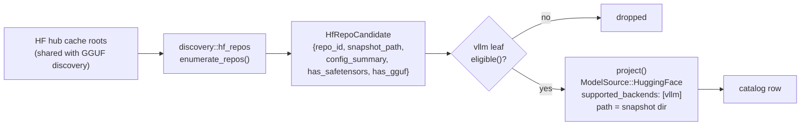

# feat: vLLM backend on the shared safetensors substrate

> Consumes the backend-neutral substrate shipped in
> [`2026-06-24-001-feat-shared-safetensors-discovery-substrate-plan.md`](2026-06-24-001-feat-shared-safetensors-discovery-substrate-plan.md)
> (the `discovery::hf_repos` enumerator, `config_to_metadata`, `ModelMetadata.quant_label`,
> the `launch::native_knobs` channel, the prefer-safetensors pull guard).
> Sibling leaf to [`2026-06-24-002-feat-mlx-backend-plan.md`](2026-06-24-002-feat-mlx-backend-plan.md);
> **the two are independent** — neither blocks the other, and whichever lands
> first pays for the shared orchestration generalization in Unit 5.

## Overview

Add vLLM as a fourth backend behind the existing `Backend` seam: direct,
process-per-model, serving safetensors HF repos through `vllm serve`'s
OpenAI-compatible HTTP API. It rides the generic supervisor unchanged and the
format-agnostic proxy forward unchanged, so the work is a backend module plus
the discovery leaf plus the minimum central wiring the no-leak contract allows.

This is the substrate's second consumer and its first *discovery* consumer — the
`discovery::hf_repos` enumerator has shipped since Part 1 with no leaf attached.

## Problem Frame

[Issue #36](https://github.com/llamastash/llamastash/issues/36) asks for vLLM and
SGLang so users running multiple engines side by side stop needing separate
management workflows for each. Today LlamaStash discovers and launches GGUF only;
a user with a safetensors repo in their HF cache sees nothing in the catalog even
though the substrate can already enumerate it.

vLLM is the highest-value target of the two: it is the standard serving engine
for safetensors / GPTQ / AWQ / FP8 weights, and unlike MLX it is not
platform-locked to Apple hardware.

## Verified environment facts

Measured on the dev host (Strix Halo, gfx1151, ROCm 7.2.4) on 2026-08-10 against
a **real** `vllm serve`, not a fixture. These anchor the design decisions below;
re-verify against the live binary before assuming any of them still hold.

| Fact | Value | Why it matters |
|---|---|---|
| Local-path serving | `vllm serve <snapshot-dir>` works | LlamaStash passes filesystem paths, not repo ids (D2) |
| `--served-model-name` | `/v1/models` reports the custom id; `root:` carries the real path; completions route by the custom name | Catalog-stable naming through the proxy (D8) |
| Readiness | `GET /health` → 200; `/version` → `{"version": "..."}` | Readiness predicate (D7) |
| Cold start | weights 0.7–1.2 s, engine init 10.8–26.6 s, ready ~45–60 s | Readiness window must be generous (D7) |
| `vllm --version` **without** a usable GPU | `RuntimeError: Failed to infer device type` | **Availability cannot exec the binary** (D6) |
| `vllm serve --help` without a GPU | same failure, at parser construction | No exec-based capability probe (D6) |
| Flag surface | 238 flags | Native-knob set is well covered (D5) |
| KV cache on unified memory | 101.9 GiB available, 8.9 M tokens | vLLM reads the GTT pool, not the 4 GiB VRAM carve-out |
| Throughput | ~150 tok/s, Qwen2.5-0.5B, `--enforce-eager` | Real GPU inference, not CPU fallback |

Flags confirmed present: `--host --port --api-key --max-model-len
--gpu-memory-utilization --tensor-parallel-size --quantization --dtype
--kv-cache-dtype --enforce-eager --max-num-seqs --trust-remote-code
--load-format --chat-template --tokenizer --download-dir --uvicorn-log-level
--allowed-origins --served-model-name`. Confirmed **absent**: `--swap-space`.

## Requirements Trace

From issue #36:

- **I1** — Detect an installed vLLM (binary / venv) during `init` and at daemon boot.
- **I2** — Scan model directories for safetensors model dirs (`config.json` + `*.safetensors`).
- **I3** — Per-model backend selection (llama.cpp / vLLM).
- **I4** — Named launch profiles per model carrying engine-specific args
  (`--gpu-memory-utilization`, `--port`, …). Presets + native knobs already
  provide this once vLLM declares its knob set.

From the multi-backend brainstorm (`docs/brainstorms/2026-06-08-multi-backend-abstraction-requirements.md`):

- **R2** — Two lifecycle shapes. vLLM is shape 1 (process-per-model).
- **R3** — Closed dispatch enum: a `Backends::Vllm` variant plus one
  `for_each_backend!` arm and one `Backends::all()` line.
- **R6** — Knob-capability subset (D4).
- **R12** — Generalized identity (D3).
- **R16** — Accelerator support declaration.
- **R17** — Per-model backend override (`start --backend vllm`).

## Scope Boundaries

- **Not SGLang.** Issue #36 asks for both. SGLang is a separate leaf on the same
  substrate and is **not** in this plan: it needs its own flag-surface and
  readiness verification against a real binary, which the dev host cannot
  currently provide without repeating the whole vLLM bring-up. Tracked in
  `TODO.md` as the follow-up. Say so plainly when closing #36 — this plan
  delivers half the issue by design, not by omission.
- **No GGUF-on-vLLM.** vLLM can load some GGUF, but R13 binds disk GGUFs to
  llama.cpp and ds4 is its one exception. vLLM claims safetensors repos only.
- **No new proxy path.** Process-per-model with a real port; the existing
  format-agnostic forward routes it unchanged. No `src/proxy/route.rs` edit.
- **No on-the-fly quantization or conversion.** LlamaStash never runs vLLM's
  quantization tooling. Discovery surfaces already-servable repos.
- **No vLLM-specific admission / OOM projection.** `project_demand` is
  GGUF-header math. vLLM launches skip it (as Lemonade does); vLLM's own
  `--gpu-memory-utilization` governs. A `config.json` param-count projection is
  a deferred `TODO.md` follow-up.
- **No container orchestration.** LlamaStash spawns a binary. Where vLLM ships
  only as a container (ROCm hosts today), the `servers[].binary` entry points at
  a thin host wrapper script — documented, never special-cased in code (D12).
- **No distributed / multi-node serving.** `--tensor-parallel-size` is exposed as
  a single-host native knob; `--pipeline-parallel-size` and the Ray paths are
  out of scope and join the loopback denylist (D9).

## Context & Research

### Relevant Code and Patterns

- `src/backend/mod.rs` — the `Backend` trait, `Backends` enum, `for_each_backend!`,
  `Backends::all()`, `routed_backend_for`, `native_knobs_for`. The three
  registration points the no-leak contract allows.
- `src/backend/ds4/mod.rs` — closest template: direct process-per-model backend
  with a native-knob table, a readiness predicate richer than "port open", and a
  forbidden-extras denylist.
- `src/backend/lemonade/backend.rs` — the template for `ModelIdentity::Backend`
  and for a backend whose models are not local GGUF files.
- `src/discovery/hf_repos.rs` — the substrate: `enumerate_repos`,
  `HfRepoCandidate { repo_id, snapshot_path, config_summary, has_safetensors,
  has_gguf }`, `config_to_metadata`, `resolve_snapshot_dir`, `estimate_params`.
- `src/launch/native_knobs.rs` — `NativeKnobDescriptor` (`Cycle` / `FreeText` /
  `Bool`) and `translate`, including the `=`-aware credential strip.
- `src/backend/server.rs` — `ServerSpec` / `ServerConfig` / `Device`, and the
  `configured_servers` / `probe_devices` / `launch_priority` hooks.
- `src/backend/identity.rs` — `ModelIdentity::{Gguf, Backend}`, `BackendModelId`.
- `tests/fixtures/` — `fake_llama_server`, `fake_ds4_server`; the pattern a
  `fake_vllm_server` follows, gated behind `test-fixtures`.
- `docs/architecture.md` § Backend neutrality contract — the hook-by-hook table
  the new backend must satisfy.

### Institutional Learnings

`docs/solutions/` does not exist in this repo; the equivalent record is the dated
plans in `docs/plans/` and the `AGENTS.md` rules. The two that bind hardest here:

- **Backend no-leak rule.** No vLLM id-string or name outside
  `src/backend/vllm/`, the three registration points in `src/backend/mod.rs`, and
  the typed config struct re-exported from `crate::config`. Not even in comments.
- **Verify against the real server, never a fixture.** The fixture proves
  LlamaStash's code; it can never prove vLLM's behavior. Every fact in the table
  above came from a live `vllm serve`.

### External References

- [vLLM PR #25908](https://github.com/vllm-project/vllm/pull/25908) — gfx1150/gfx1151 support.
- [vLLM OpenAI-compatible server docs](https://docs.vllm.ai/en/latest/serving/openai_compatible_server.html)
- [AMD ROCm vLLM guide](https://rocm.docs.amd.com/en/7.13.0-preview/ai-inference/vllm.html)
- `rocm/vllm:rocm7.13.0_gfx1151_ubuntu24.04_py3.13_pytorch_2.10.0_vllm_0.19.1` — the image used for verification.

## Key Technical Decisions

- **D1 — Reuse `ModelSource::HuggingFace`; do not add `ModelSource::Vllm`.**
  A safetensors repo in the HF cache *is* HuggingFace-sourced; what differs is
  the weight format and which backends can serve it, and `supported_backends`
  already carries that. `src/discovery/mod.rs` explicitly calls
  `ModelSource::Lemonade` "the single file-less-source special case, and the only
  place a backend is named for a discovery source". Adding a second one entrenches
  the leak the no-leak rule exists to prevent. **This deliberately deviates from
  the MLX plan**, which proposed `ModelSource::Mlx`; if MLX lands first with its
  own variant, this plan's Unit 3 should be re-read as an argument for the
  deferred `ModelSource::Backend(id)` refactor instead.
- **D2 — `DiscoveredModel.path` is the snapshot *directory* for a vLLM row.**
  There is no single launchable file. This is the highest-risk decision in the
  plan: the field is documented as "canonical absolute path to the launchable
  file" and callers may assume a file. Unit 1 audits and pins that with
  characterization tests before anything depends on it.
- **D3 — Identity is `ModelIdentity::Backend { backend: "vllm", name: <repo_id> }`.**
  `ModelIdentity::Gguf` wraps `ModelId { path, header_blake3 }`; a safetensors
  directory has no GGUF header to hash. `repo_id` is stable across re-pulls in a
  way a snapshot revision path is not.
- **D4 — `capabilities()` honors exactly `KnobField::Ctx`**, translated to
  `--max-model-len`. Evidenced, and it keeps the one knob users actually reach
  for on the shared row instead of duplicating it as a native knob. Everything
  else is `none()`; the shared-IR rows filter out of the picker for a vLLM row.
- **D5 — Native knobs (8), all verified present in the 238-flag surface:**
  `gpu_memory_utilization`, `max_num_seqs`, `tensor_parallel_size`, `dtype`,
  `kv_cache_dtype`, `quantization`, `enforce_eager`, `trust_remote_code`.
  The long tail rides `extras`.
- **D6 — Availability is a filesystem check only, never an exec.** Verified:
  `vllm --version` raises `Failed to infer device type` on a box with no usable
  GPU, so an exec-based probe would report "not installed" on exactly the
  machines where a user is configuring it. `installed()` = the configured
  `servers[].binary` exists, else a `PATH` lookup resolves. `probe_devices`
  returns empty (device-less server, bare backend id), like ds4 and Lemonade.
- **D7 — Readiness = `GET /health` → 200 **and** `/v1/models` advertising the
  served name.** Health alone flips before the engine finishes; the model-list
  check closes the window. Budget must tolerate minutes: 45–60 s cold on a 0.5B,
  and large models profile far longer.
- **D8 — Always pass `--served-model-name <catalog name>`.** Verified to control
  the `/v1/models` id and the accepted request `model`. Without it vLLM advertises
  the raw path, which would leak a snapshot directory into the proxy's model list.
- **D9 — Extend the loopback/credential denylist** with vLLM's escape hatches:
  `--host`, `--api-key`, `--allowed-origins`, `--ssl-*`, `--allowed-local-media-path`,
  `--pipeline-parallel-size`, and the Ray/distributed flags. Same shape as ds4's
  `DS4_FORBIDDEN_EXTRA_HEADS`.
- **D10 — Process-per-model.** `start` / `stop` stay on their trait defaults; no
  lifecycle plumbing, no `umbrella_launch_id`, no `supervise_at_boot`.
- **D11 — Default-on when the binary resolves**, matching ds4 and Lemonade.
  `backend.vllm.enabled` is the tri-state; `--vllm` / `LLAMASTASH_VLLM=1` force on.
- **D12 — Container hosts use a wrapper script.** On ROCm-only machines vLLM
  exists solely as a container image. That is a *documentation* answer
  (`servers: [{binary: /path/to/vllm-wrapper}]`), not a code path.

## Open Questions

### Resolved During Planning

- *Can vLLM run on the dev host at all?* Yes — verified end-to-end with real GPU
  inference via the official gfx1151 image. This gated the whole plan.
- *Does the 4 GiB VRAM carve-out cap vLLM on Strix Halo?* No — it profiles
  101.9 GiB of KV cache from the GTT pool.
- *Can availability be probed by running the binary?* No (D6). Verified failure.
- *Does vLLM accept a directory path and a custom served name?* Yes, both (D2, D8).
- *New `ModelSource` variant?* No (D1).

### Deferred to Implementation

- **Exact eligibility predicate.** `has_safetensors && !has_gguf` is the floor,
  but vLLM refuses some architectures. Whether to gate on
  `config_summary.model_type` against a known-arch list, or launch optimistically
  and let the process fail with a readable error, needs a real refusal observed
  first. Optimistic is the current lean — an allowlist rots against upstream.
- **Whether `--max-model-len` should default to the config's
  `max_position_embeddings` or be left unset.** Unset lets vLLM decide; setting it
  makes the launch reproducible. Decide against observed memory behavior on a
  real launch of a mid-size model.
- **Multi-GPU device selection.** vLLM uses `CUDA_VISIBLE_DEVICES` /
  `HIP_VISIBLE_DEVICES` env rather than a `--device` flag, so the existing
  device-selector row does not map cleanly. Single-device for the MVP; the env
  translation is a follow-up once a multi-GPU host is available to test on.
- **`quant_label` population.** The substrate field exists and is still unrendered.
  Whether vLLM's leaf can fill it reliably from `config.json`'s
  `quantization_config` block needs real GPTQ/AWQ repos to inspect.

## High-Level Technical Design

> *This illustrates the intended approach and is directional guidance for review,
> not implementation specification. The implementing agent should treat it as
> context, not code to reproduce.*

Discovery: the substrate already walks the cache; the leaf is a predicate plus a
projection.

Launch: the knob split between the shared IR and the native channel.

| Input | Where it lives | Rendered as |
|---|---|---|
| Context length | shared `KnobField::Ctx` (D4) | `--max-model-len N` |
| GPU memory fraction | native knob | `--gpu-memory-utilization F` |
| Batch ceiling | native knob | `--max-num-seqs N` |
| Tensor parallel | native knob | `--tensor-parallel-size N` |
| Weight / KV dtype | native knobs | `--dtype X`, `--kv-cache-dtype X` |
| Quantization | native knob | `--quantization X` |
| Eager / remote code | native bools | `--enforce-eager`, `--trust-remote-code` |
| Catalog name | always emitted (D8) | `--served-model-name <name>` |
| Port | supervisor-allocated | `--port N` |
| Anything else | `extras` | verbatim, after the denylist strip (D9) |

## Implementation Units

- [ ] **Unit 1: Path-shape audit — can a catalog row be a directory?**

**Goal:** Establish, before any vLLM code exists, exactly which generic code
paths assume `DiscoveredModel.path` is a file, and pin today's behavior so D2
does not break GGUF.

**Requirements:** D2

**Dependencies:** None

**Files:**
- Modify: `src/discovery/mod.rs` (doc comment on `path` if the contract widens)
- Test: `tests/discovery_scan_test.rs`

**Approach:**
- Audit every consumer of `DiscoveredModel.path` and `parent`: the TUI list and
  info pane, `cli::resolve` fuzzy matching, delete planning (`src/tui/delete.rs`),
  the GGUF header re-read paths, size/`weights_bytes` computation, and favorites.
- Classify each as directory-safe, directory-hostile, or needs-a-guard. Record
  the result in the plan's deferred notes and fix only what a vLLM row would hit.
- Deliberately no vLLM code in this unit — it is the characterization pass that
  makes Unit 3 safe.

**Execution note:** Characterization-first. Add tests that pin current GGUF
behavior for each path consumer *before* widening the contract.

**Patterns to follow:** `src/tui/delete.rs` resolves a plan from a row and is the
most path-shape-sensitive consumer; start there.

**Test scenarios:**
- Happy path: a GGUF row's delete plan, display label, and fuzzy-resolve results
  are unchanged by any doc/contract widening.
- Edge case: a row whose `path` is a directory resolves a display name from the
  directory basename rather than a file stem.
- Edge case: a directory-valued row does not attempt a GGUF header read and
  surfaces no `parse_error` for the absence.
- Error path: delete planning on a directory-valued row refuses rather than
  recursively removing an unexpected tree.

**Verification:** The audit lists every consumer with a classification, and the
GGUF suite is green with the new characterization tests added.

---

- [ ] **Unit 2: `VllmBackend` trait impl + identity + registry wiring**

**Goal:** A registered, dispatchable backend that reports itself correctly and
launches nothing yet.

**Requirements:** R2, R3, R12, R16, I1, D3, D6, D10, D11

**Dependencies:** None

**Files:**
- Create: `src/backend/vllm/mod.rs`
- Modify: `src/backend/mod.rs` (`pub mod vllm;`, the `use`, a `Backends` variant,
  one `for_each_backend!` arm, one `Backends::all()` line, one `BackendConfig` field)
- Modify: `src/config/mod.rs` (re-export the typed config struct)
- Test: `src/backend/vllm/mod.rs` inline `#[cfg(test)] mod tests`

**Approach:**
- `id()`, `lifecycle()` (process-per-model), `capabilities()` per D4,
  `launch_priority()` below llama.cpp so a GGUF never prefers it.
- `installed()` / `available()` as a filesystem check only (D6) — this is the
  single most important detail in the unit and the one most likely to be
  "helpfully" written as an exec.
- `configured_servers` from the `backend.vllm.servers` array; `probe_devices`
  returns empty (device-less server → bare backend id).
- Identity per D3; `serves_mode` chat/completions plus embeddings where vLLM
  supports it.
- `start` / `stop` stay on their defaults (D10).

**Patterns to follow:** `src/backend/ds4/mod.rs` for the direct-backend shape;
`src/backend/lemonade/backend.rs` for `ModelIdentity::Backend`.

**Test scenarios:**
- Happy path: `Backends::all()` includes the new variant and every defaulted
  trait method forwards through `for_each_backend!`.
- Happy path: `installed()` is true when a configured binary path exists.
- Edge case: `installed()` is false when the configured path is absent, and
  falls back to a `PATH` lookup when no path is configured.
- **Error path (regression guard): `installed()` performs no process spawn.**
  Assert against a binary that would fail if executed — this pins D6.
- Edge case: `capabilities()` contains exactly `Ctx`.
- Integration: a neutrality test asserts no vLLM id-string appears outside the
  module and the three registration points.

**Verification:** `status --json .backends[]` shows a `vllm` row with correct
`installed` / `enabled`, with zero change to the other three rows.

---

- [ ] **Unit 3: Discovery leaf — eligibility predicate + projection**

**Goal:** Safetensors repos in the HF cache appear in the catalog tagged for vLLM.

**Requirements:** I2, R14, D1, D2

**Dependencies:** Unit 1, Unit 2

**Files:**
- Create: `src/backend/vllm/discovery.rs`
- Modify: `src/backend/vllm/mod.rs` (wire the leaf)
- Test: `tests/discovery_scan_test.rs`, inline tests in the new module

**Approach:**
- `eligible(&HfRepoCandidate)` — `has_safetensors && !has_gguf` plus whatever the
  deferred arch question resolves to. Start optimistic.
- `project(candidate) -> DiscoveredModel` — `ModelSource::HuggingFace` (D1),
  `path` = snapshot dir (D2), `parent` = the `models--*` repo dir,
  `display_label` = `repo_id` (the directory basename is an opaque revision hash,
  so this is required, not cosmetic), `metadata` from `config_to_metadata`,
  `supported_backends: ["vllm"]`, `weights_bytes` = summed `*.safetensors` sizes.

**Patterns to follow:** `src/backend/lemonade/discovery.rs` for a non-GGUF source
that records its own `supported_backends`.

**Test scenarios:**
- Happy path: a fixture repo with `config.json` + `model.safetensors` yields one
  row with `supported_backends == ["vllm"]` and the repo id as display label.
- Edge case: a repo with both safetensors and GGUF is **not** claimed (the GGUF
  scanner owns it) and appears exactly once in the catalog.
- Edge case: a repo with `config.json` but no safetensors yields no row.
- Edge case: a sharded repo (`model-00001-of-00003.safetensors` + index) yields
  one row whose `weights_bytes` sums every shard.
- Error path: an unparseable `config.json` still yields a row, with `metadata`
  `None` and no panic.
- Integration: with vLLM disabled, the catalog is byte-identical to today's —
  no safetensors rows leak into a GGUF-only install.

**Verification:** `list --json` gains safetensors rows only when vLLM is enabled;
`llamastash list` shows them with a `vllm` backend cell.

---

- [ ] **Unit 4: Native knobs + argv translation + denylist**

**Goal:** vLLM's tunables render in the picker, persist in presets, and translate
to verified flags.

**Requirements:** I4, R6, D4, D5, D8, D9

**Dependencies:** Unit 2

**Files:**
- Modify: `src/backend/vllm/mod.rs` (`native_knobs`, `prepare_launch`,
  `forbidden_extra_heads`)
- Test: inline tests

**Approach:**
- Declare the 8 descriptors from D5 with sensible cycle stops.
- `prepare_launch` builds argv: model path, `--served-model-name`, `--port`,
  `--host 127.0.0.1`, `--max-model-len` from `Ctx`, then `native_knobs::translate`
  for the rest, then stripped `extras`.
- `forbidden_extra_heads` per D9.

**Test scenarios:**
- Happy path: a launch with no knobs set emits the minimal argv — path, served
  name, port, loopback host — and nothing else.
- Happy path: each of the 8 native knobs renders its verified flag when set.
- Edge case: an unset native knob emits no flag at all (not an empty value).
- Edge case: `Ctx` renders `--max-model-len`, and no native knob duplicates it.
- **Error path: `--host 0.0.0.0` in extras is stripped**, in both the
  space-separated and `--host=0.0.0.0` forms.
- Error path: `--api-key`, `--allowed-origins`, and `--pipeline-parallel-size` in
  extras are stripped.
- Edge case: `--served-model-name` is always emitted even when the user supplies
  their own in extras — and the user's is stripped, so the proxy's view stays
  authoritative.
- Integration: `backend_knobs` round-trip through a preset and reappear on relaunch.

**Verification:** `last-params --json` shows the knobs; a dry argv comparison
matches a hand-built `vllm serve` invocation.

---

- [ ] **Unit 5: Launch orchestration + readiness + `fake_vllm_server`**

**Goal:** `start` on a vLLM row spawns the real binary through the generic
supervisor and reaches Ready.

**Requirements:** R17, D7, D10

**Dependencies:** Unit 2, Unit 3, Unit 4

**Files:**
- Modify: `src/daemon/launch_service.rs` (generalize the identity + binary branch)
- Modify: `src/backend/vllm/mod.rs` (readiness)
- Create: `tests/fixtures/fake_vllm_server.rs`
- Modify: `Cargo.toml` (register the fixture bin behind `test-fixtures`)
- Test: `tests/vllm_backend_test.rs`

**Approach:**
- The riskiest edit: the orchestrator's binary-selection and identity branches are
  bi-modal (GGUF → `llama-server`, Lemonade synthetic → umbrella). A third shape
  — process-per-model, non-GGUF, own binary — generalizes both. Isolate behind the
  Unit 1 characterization tests plus new ones here.
- Readiness per D7, with a window sized for minutes, not seconds.
- `fake_vllm_server` mimics `/health`, `/version`, `/v1/models`, and
  `/v1/chat/completions`, including a configurable delay before health flips —
  the fixture must be able to reproduce the slow-start window, since that is the
  behavior most likely to regress.

**Execution note:** Characterization-first on `launch_service.rs`. Pin the
existing llama.cpp and Lemonade launch argv before touching the branch.

**Test scenarios:**
- Happy path: a vLLM row starts, reaches Ready, records a running snapshot, and
  stops cleanly.
- Happy path: llama.cpp and Lemonade launch argv are byte-identical to before the
  branch generalization.
- Edge case: readiness does **not** flip on `/health` 200 alone while
  `/v1/models` is still empty.
- Edge case: readiness flips when `/v1/models` advertises the served name.
- Error path: a binary that exits immediately surfaces a launch error with the
  captured stderr, not a readiness timeout.
- Error path: a server that never becomes ready times out with a diagnostic
  naming the model and elapsed time.
- Integration: `stop` reaps the process; no orphan survives (assert via the
  supervisor registry and a PID check).

**Verification:** `start` → `status` shows `ready` with `backend: "vllm"`; `stop`
returns the row to stopped with no orphan.

---

- [ ] **Unit 6: Config, enablement, and CLI/daemon surface**

**Goal:** Users can enable, disable, target, and configure vLLM.

**Requirements:** I1, I3, R17, D11

**Dependencies:** Unit 2

**Files:**
- Create/Modify: the `VllmConfig` struct in `src/backend/vllm/mod.rs`
- Modify: `src/config/loader.rs` (the `backend.vllm:` block), `src/config/mod.rs`
- Modify: `src/cli/daemon.rs` (`--vllm` / `--no-vllm`), `src/daemon/context.rs`
- Modify: `config.example.yaml`
- Test: `tests/daemon_config_integration_test.rs`, `tests/cli_config_test.rs`

**Approach:**
- `backend.vllm.servers: [{binary, name?}]` + `backend.vllm.enabled` tri-state,
  mirroring ds4 exactly.
- `--backend vllm` needs no CLI edit — `BackendChoice::Explicit(String)` takes an
  id as data.
- Env force `LLAMASTASH_VLLM=1`, carried through the detached re-exec.

**Test scenarios:**
- Happy path: `backend.vllm.servers[0].binary` is used in preference to `PATH`.
- Edge case: `enabled` unset with the binary present → on; unset with the binary
  absent → silently off.
- Edge case: `enabled: false` with the binary present → off, and no vLLM rows in
  the catalog.
- Edge case: `--vllm` overrides `enabled: false`.
- Error path: a typo'd key under `backend.vllm:` is rejected at startup with the
  key named, matching the existing config-typo behavior.
- Integration: a default install with no vLLM binary produces byte-identical
  `status --json` and `list --json` to today.

**Verification:** `daemon status` and `status --json .backends` reflect each
enable/disable path.

---

- [ ] **Unit 7: TUI + CLI surfaces**

**Goal:** vLLM rows look right everywhere a user reads the catalog.

**Requirements:** I3, R14

**Dependencies:** Unit 3, Unit 4

**Files:**
- Modify: `src/tui/list_pane.rs`, `src/tui/info_pane.rs`, `src/tui/app.rs`
- Modify: `src/cli/output.rs`, `src/cli/list.rs`
- Test: `tests/tui_e2e_render_test.rs`, `tests/list_models_test.rs`

**Approach:**
- The generic backend chip already renders from `backend.id()`; verify a vLLM row
  gets one with no new branch.
- The launch picker shows vLLM's native knobs and hides the llama.cpp typed rows
  for a vLLM row (the mechanism exists for ds4).
- Size / params columns come from `weights_bytes` and the config-dim estimate;
  quant cell falls back to `quant_label` when present, else a dash.

**Test scenarios:**
- Happy path: a vLLM row renders with a `vllm` chip and the repo id as its name.
- Edge case: the quant column shows a dash (not `Unknown(0)`) for a row with no
  GGML quant.
- Edge case: selecting a vLLM row shows its 8 native knobs and no llama.cpp
  typed knobs.
- Integration: golden render of a mixed catalog (GGUF + vLLM rows) — this is the
  regression net for column alignment.

**Verification:** `--render` frames inspected by eye for a mixed catalog, per the
project's TUI rule; golden snapshots updated deliberately.

---

- [ ] **Unit 8: Docs, TODO, real-vLLM UAT**

**Goal:** Ship the docs in the same change, and prove it on the real binary.

**Requirements:** all

**Dependencies:** Units 1–7

**Files:**
- Modify: `docs/architecture.md`, `docs/usage.md`, `docs/troubleshooting.md`,
  `README.md`, `CHANGELOG.md`, `TODO.md`, `AGENTS.md` (scope bullet only if the
  200-line ceiling allows — otherwise a pointer), `config.example.yaml`
- Create: `docs/vllm-setup.md` (install routes, and the container-wrapper recipe per D12)
- Modify: `docs/testing/hardware-uat.md`
- Create: `scripts/vllm/` — promote the verification harness (`serve|help|version|shell`)
  with a README entry, per the reusable-script rule

**Approach:**
- Document the container-wrapper path honestly: on ROCm-only hosts vLLM is a
  container, and the `servers[].binary` entry is a wrapper script. Include the
  working `docker run` flags, including the **numeric** `--group-add` gotcha.
- `TODO.md` entries for every deferred item named above, plus SGLang.

**Test scenarios:** Test expectation: none — docs and scripts. The UAT below is
the verification.

**Verification:**
- A full real-vLLM lifecycle on the dev host: discovery → start → ready →
  `/v1/chat/completions` returning content → `status` → stop, with no orphan.
- `status --json` / `list --json` on a vLLM-disabled install byte-identical to
  pre-change output.
- `make lint`, `make test`, `make doc` clean.

## System-Wide Impact

- **Interaction graph:** discovery rescan loop, the launch orchestrator's
  binary/identity branch (the one genuinely shared edit), `status` assembly,
  the proxy's auto-start path, orphan adoption, `doctor`.
- **Error propagation:** a vLLM launch failure must surface the process's stderr,
  not a bare readiness timeout — vLLM's failure messages (OOM, unsupported arch,
  bad quantization) are the actionable content.
- **State lifecycle risks:** a vLLM row's `path` is a directory (D2); delete
  planning must refuse rather than recursively remove. Adoption must key on the
  recorded `resolved_backend` tag, as ds4 does.
- **API surface parity:** every catalog surface — TUI list, info pane, `list`,
  `list --json`, `show`, `status`, `last-params` — must handle a row with no GGML
  quant and a directory path.
- **Integration coverage:** the GGUF-unchanged assertion is the single most
  valuable test in this plan. A vLLM-disabled install must produce byte-identical
  JSON, and Unit 6 pins that.
- **Unchanged invariants:** R13 (disk GGUFs bind llama.cpp) is untouched — ds4
  remains its only exception. The proxy contract, exit codes, IPC schema version,
  and the five themes are unchanged. `ModelIdentity::Gguf`'s wire shape is
  untouched, so `state.json` rows keep deserializing.

## Risks & Dependencies

| Risk | Likelihood | Impact | Mitigation |
|---|---|---|---|
| `DiscoveredModel.path` as a directory breaks a generic consumer | High | High | Unit 1 is a dedicated characterization pass before any dependent code |
| The `launch_service.rs` branch generalization regresses llama.cpp | Medium | High | Characterization tests pinning existing argv, byte-for-byte, before the edit |
| Availability probe written as an exec | Medium | High | Verified-failure regression test in Unit 2 asserting no spawn |
| Slow-start readiness flakes in CI | Medium | Medium | `fake_vllm_server` with a configurable delay; generous, explicit budgets |
| vLLM flag surface drifts (238 flags, fast-moving project) | High | Low | Native knobs are a small verified subset; the tail rides `extras`; docs say to re-verify against live `--help` |
| Eligibility predicate too optimistic → launch failures on unsupported archs | Medium | Medium | Surface vLLM's own error text; revisit the allowlist question with real refusals |
| No host-native vLLM on the dev box | Certain | Medium | Container + wrapper is documented and was used for verification |
| Issue #36 half-answered (no SGLang) | Certain | Low | Stated in Scope Boundaries and in the issue reply; tracked in `TODO.md` |

## Documentation / Operational Notes

- New `docs/vllm-setup.md` covering: pip/venv install (CUDA), the ROCm container
  route, the wrapper-script recipe, and the numeric-GID docker gotcha.
- `docs/troubleshooting.md`: "vLLM shows as not installed" → the filesystem-only
  probe and how to point `backend.vllm.servers[0].binary` at a wrapper.
- `CHANGELOG.md`: one line under `[Unreleased]`.
- No migration. Additive config, additive JSON, additive catalog rows.

## Phased Delivery

### Phase 1 — foundation (Units 1, 2)
The path-shape audit and a registered backend that discovers and launches
nothing. Landable alone; zero user-visible change beyond a `status` backend row.

### Phase 2 — discovery and launch (Units 3, 4, 5)
Models appear and launch. Unit 5 carries the shared-orchestration risk.

### Phase 3 — surfaces and docs (Units 6, 7, 8)
Enablement, TUI/CLI polish, docs, and the real-hardware UAT.

## Sources & References

- Origin issue: [llamastash/llamastash#36](https://github.com/llamastash/llamastash/issues/36)
- Substrate: [`docs/plans/2026-06-24-001-feat-shared-safetensors-discovery-substrate-plan.md`](2026-06-24-001-feat-shared-safetensors-discovery-substrate-plan.md)
- Sibling leaf: [`docs/plans/2026-06-24-002-feat-mlx-backend-plan.md`](2026-06-24-002-feat-mlx-backend-plan.md)
- Closest template: [`docs/plans/2026-07-10-001-feat-ds4-backend-plan.md`](2026-07-10-001-feat-ds4-backend-plan.md)
- Server abstraction: [`docs/plans/2026-07-16-001-feat-server-abstraction-plan.md`](2026-07-16-001-feat-server-abstraction-plan.md)
- Brainstorm: [`docs/brainstorms/2026-06-08-multi-backend-abstraction-requirements.md`](../brainstorms/2026-06-08-multi-backend-abstraction-requirements.md)
- Backend neutrality contract: `docs/architecture.md` § Backend neutrality contract
